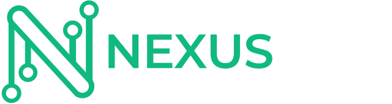
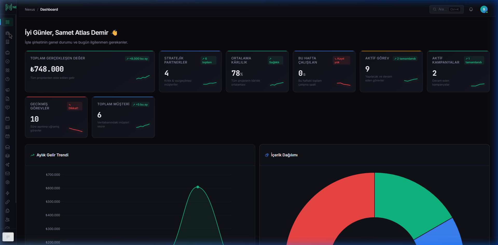
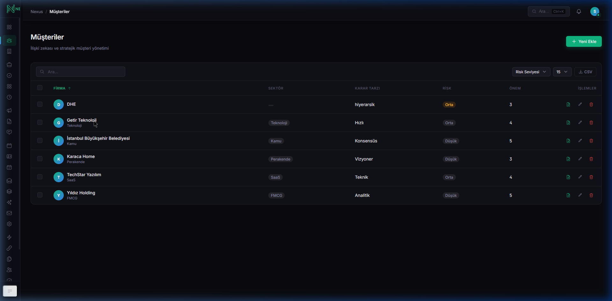
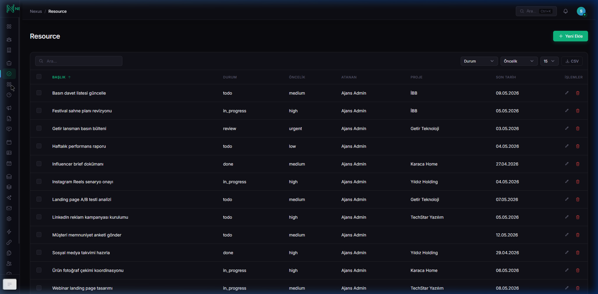
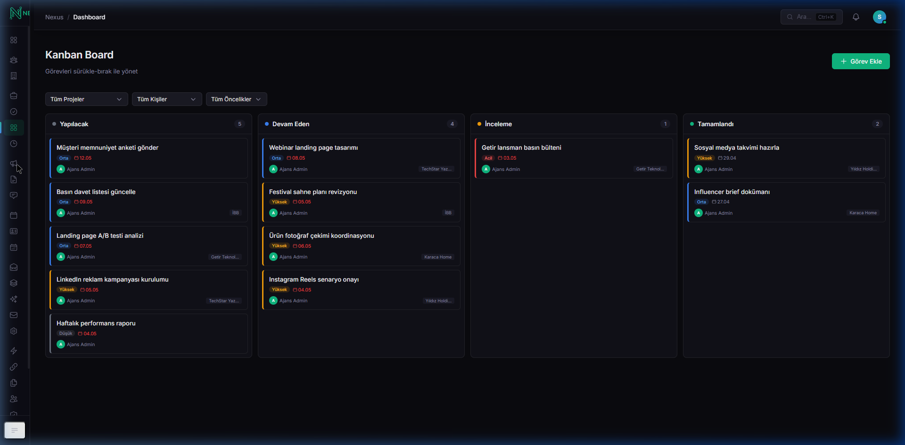
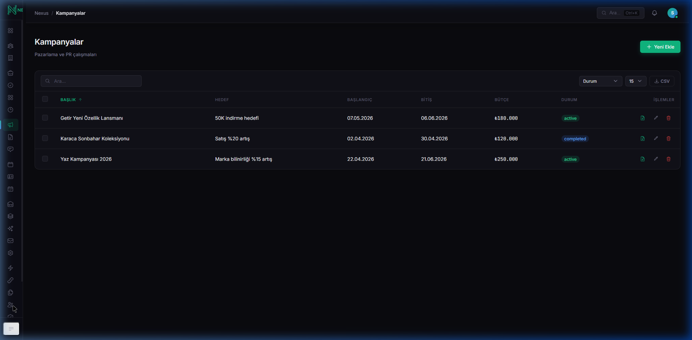

# ADA Co-OS — Digital Intelligence Platform 🧠

<p align="center">
  
  <br>
  <em>Bağlar. Hatırlatır. Analiz Eder.</em>
  <br><br>
  
  
  
  
</p>

---

> [!WARNING]
> **Önemli Uyarı / Important Notice:**  
> Bu proje aktif geliştirme sürecindedir. Tanıtım (landing) sayfalarında vaat edilen veya belirtilen bazı özelliklerin henüz tam olarak çalışmadığı, geliştirme aşamasında olduğu veya vaat edildiği gibi davranmadığı noktalar olabilir. Proje açık kaynaklı bir prototip / referans uygulaması olarak sunulmaktadır.
> 
> *This project is actively under development. There may be points where certain features do not work exactly as promised or specified on the landing pages. The project is presented as an open-source prototype / reference application.*


ADA Co-OS, **ADA Creative Co.** tarafından geliştirilen; ajansların ve kurumsal iletişim ekiplerinin müşteri, proje, kampanya, içerik ve iletişim yönetimini tek bir multi-tenant platformdan yapmasını sağlayan kurumsal dijital zeka sistemidir.

## ✨ Öne Çıkanlar

- **Multi-Tenant Mimari** — Row-level izolasyon ile tek kurulumdan birden çok organizasyon
- **3 Katmanlı RBAC** — 24 rol, 54 permission, platform/tenant/workspace scope'ları
- **Webmaster Paneli** — Platform sahibine özel `/platform` dashboard'u
- **Impersonate** — Webmaster kiracı gözünden admin panelini kullanabilir
- **2FA** — Google Authenticator desteği; platform adminleri için zorunlu, diğerleri opsiyonel
- **Masaüstü Uygulaması** — Electron tabanlı Windows installer (~106 MB), internet bağımsız
- **IMAP E-posta** — OAuth2 + App Password ile Gmail/Outlook senkronizasyonu
- **REST API** — Sanctum ile korunan `/api/v1` endpointleri
- **PDF Raporlama** — Müşteri, proje ve kampanya otomatik raporları
- **Otomasyon Motoru** — Trigger-based iş akışları, Slack/Discord/Generic webhook
- **Premium Dark UI** — Linear/Stripe estetiğinde özel design system

## 📸 Ekran Görüntüleri / Screenshots

### 📊 Genel Bakış (Dashboard)
*Sistem metrikleri, aktif görevler, bütçe takibi ve operasyonel özet.*


---

### 📁 Proje Yönetimi (Projects List)
*Tüm aktif ve tamamlanmış projelerin listesi, ilerleme durumları ve atanan ekipler.*



---

### 📋 Kanban Board (Task Board)
*Görevlerin durum bazlı takibi, öncelik dereceleri ve sürükle-bırak aşamaları.*



---

### ⏳ Zaman Çizelgesi (Gantt Chart & Timeline)
*Proje ve görevlerin zaman eksenli takibi, termin tarihleri ve bağımlılık ilişkileri.*



---

### 📎 Dosya ve Belge Yönetimi (Files)
*Tenant düzeyinde kategorize edilmiş medya varlıkları, tasarım dosyaları ve dokümanlar.*



---

### 👥 Ekip Yönetimi (Team Management)
*Organizasyon üyeleri, roller, yetkiler ve platform davetleri.*




## 🏗 Teknik Mimari

| Katman | Teknoloji |
|:---|:---|
| **Framework** | Laravel 12 (PHP 8.4) |
| **Frontend** | Livewire 3 + Alpine.js |
| **CSS** | Özel Dark Design System (`nexus-admin.css`) |
| **Veritabanı** | MySQL/MariaDB (production), SQLite (local) |
| **Yetkilendirme** | Spatie Laravel Permission |
| **Denetim** | Laravel Auditing (owen-it) |
| **E-posta** | IMAP (webklex/laravel-imap) + SMTP |
| **API** | Laravel Sanctum |
| **Masaüstü** | NativePHP / Electron |
| **Varlıklar** | Vite 6 + Chart.js + FullCalendar |
| **Fonts** | Inter + JetBrains Mono |

## 📦 Modüller

### Admin Paneli (`/admin`)
| Modül | Açıklama |
|:---|:---|
| **Dashboard** | KPI kartları, gelir/görev/kampanya/bütçe grafikleri, zamanlayıcı |
| **Project Management** | Projeler, görevler, Kanban board, Gantt şeması, zaman takibi |
| **Marketing & Content** | Kampanyalar, içerik takvimi, sosyal medya planlama |
| **Media & Insights** | Medya yansımaları, etkinlikler, basın rehberi |
| **Internal Tools** | IMAP gelen kutusu, araçlar, marka varlıkları, e-posta şablonları |
| **System** | Teklif motoru, PDF raporlama, denetim kaydı, otomasyon kuralları |

### Webmaster Paneli (`/platform`)
| Modül | Açıklama |
|:---|:---|
| **Dashboard** | MRR, aktif kiracılar, plan dağılımı |
| **Kiracı Yönetimi** | Tenant CRUD, durum takibi, impersonate |
| **Plan Yönetimi** | Starter / Pro / Enterprise |
| **Fatura Yönetimi** | Fatura oluşturma ve takip |
| **Ekip & Duyurular** | Platform ekibi yönetimi, sistem bildirimleri |
| **Platform Ayarları** | Modül toggle'ları, kategori görünürlük kontrolü |

### REST API (`/api/v1`)
- Sanctum token authentication
- Projeler, görevler ve dashboard endpointleri
- Detay için [`docs/API_ROUTES.md`](./docs/API_ROUTES.md)

## 🗂 Dizin Yapısı

```
nexus-ada/
├── app/
│   ├── Http/Middleware/
│   │   ├── SetTenantContext.php      # Tenant bağlamı
│   │   └── EnsureTenantAccess.php    # /admin/* erişim kontrolü
│   ├── Livewire/
│   │   ├── Admin/                    # Admin Livewire bileşenleri
│   │   ├── Client/                   # Müşteri portalı bileşenleri
│   │   └── Platform/                 # Webmaster Livewire bileşenleri
│   ├── Models/Traits/
│   │   └── BelongsToTenant.php       # Row-level tenant izolasyonu
│   └── Services/
│       ├── AutomationEngine.php
│       ├── WebhookDispatcher.php
│       └── ImapSyncService.php
├── BTM_Kesisim/                      # BTM Kesişim başvuru materyalleri
│   ├── basvuru_paketi.md             # Form cevapları + strateji
│   └── nexus_ada_pitch_deck.html     # 11 slayt pitch deck (PDF'e yazdır)
├── docs/                             # Teknik dökümanlar
│   ├── ARCHITECTURE.md
│   ├── DATABASE.md
│   ├── SECURITY.md
│   ├── DEPLOYMENT.md
│   ├── API_ROUTES.md
│   └── ...
├── routes/
│   ├── admin.php
│   ├── platform.php
│   ├── client.php
│   ├── api.php                       # /api/v1 endpointleri
│   └── web.php
└── resources/
    ├── css/nexus-admin.css           # Dark design system
    └── js/nexus-admin.js
```

## 🚀 Kurulum

### Gereksinimler
- PHP 8.4+, Composer, Node.js 20+, MySQL 8.0+

```bash
git clone https://github.com/adacreativeco/nexus-ada.git
cd nexus-ada
composer install
npm install
cp .env.example .env
php artisan key:generate
php artisan migrate --seed
npm run build
php artisan serve
```

### Masaüstü Uygulaması (Windows)
```bash
npm run electron:build
# dist/ altında NSIS installer oluşur
```

## 🔐 Varsayılan Erişim Bilgileri (Yerel Kurulum)

Veritabanı seed edildikten sonra yerel ortamda aşağıdaki varsayılan hesapları kullanabilirsiniz:

| Panel | URL | E-posta | Rol |
|:---|:---|:---|:---|
| Platform / Webmaster | `http://localhost:8000/platform` | `master@adacreative.co` | `super_admin` |
| Admin (Varsayılan Kiracı) | `http://localhost:8000/admin/login` | `ajans@adacreative.co` | `tenant_owner` |

> **Not:** Şifreler varsayılan olarak `password` olarak belirlenmiştir.

## 🛡 Güvenlik

Sistem; 3 katmanlı yetkilendirme (RBAC), IMAP şifre şifrelemesi, denetim izleri (Audit Trail), iki aşamalı doğrulama (2FA) ve tam KVKK uyumluluğu gibi kurumsal düzeyde güvenlik özellikleri barındırmaktadır.

## 📄 Lisans / License

Bu proje **Apache Lisansı 2.0 (Apache License 2.0)** ile lisanslanmıştır. Detaylar için [`LICENSE`](./LICENSE) dosyasına göz atabilirsiniz.

*This project is licensed under the **Apache License 2.0**. See the [`LICENSE`](./LICENSE) file for details.*

---

*Son güncelleme: 7 Temmuz 2026 — v3.1 (2FA + IMAP + REST API + Module Toggles)*


<p align="center">
  <strong>crafted by <a href="https://adacreative.co">ADA Creative Co.</a></strong><br>
  <code>#elevatewithADA</code>
</p>
