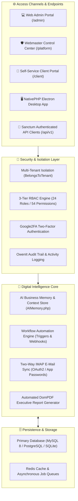

# 🧠 ADA Co-OS (NexusADA)

<div align="center">

[](https://laravel.com/)
[](https://php.net/)
[](https://livewire.laravel.com/)
[](https://nativephp.com/)
[](https://tailwindcss.com/)
[](LICENSE)
[](tests/)
[](https://github.com/adacreativeco/NexusADA/stargazers)
[](https://github.com/adacreativeco/NexusADA/releases)

<br/>

**Multi-Tenant Enterprise Operating System, Digital Intelligence & Agency Operations Platform.**

*Connects. Remembers. Analyzes.*

[English Documentation](README.md) • [🇹🇷 Türkçe Dokümantasyon](README.tr.md) • [📖 Case Study](https://adacreative.co/vaka-analizleri/nexus-ada)

</div>

---

**ADA Co-OS (NexusADA)** is an all-in-one corporate operations and digital intelligence platform engineered by **ADA Creative Co.** for creative agencies, consultancies, and modern enterprise teams. It unifies client relationships, project delivery, financial proposals, IMAP communications, workflow automations, and AI memory into a single, row-level isolated multi-tenant ecosystem with a native desktop Electron application.

---

## 📸 Visual Showcase

<div align="center">

### 📊 Modern Operations & Analytics Dashboard
*Executive overview with financial KPIs, project Gantt timelines, active tasks, and team utilization.*


<br/>

| 📁 Multi-Tenant Project Pipeline | 🤖 AI Assistant & Memory Core |
|:---:|:---:|
|  |  |
| *Task kanban boards, milestones, and client access.* | *Contextual business memory and prompt orchestration.* |

| 💼 Client Portal & Invoicing | ⚡ Workflow Automation Engine |
|:---:|:---:|
|  |  |
| *Self-service client portal, proposals & DomPDF reports.* | *Event-driven webhook dispatchers (Slack, Discord).* |

</div>

---

## 🏗️ System Architecture


```mermaid
flowchart TD
    subgraph ClientAccess["🌐 Access Channels & Endpoints"]
        WebAdmin["💻 Web Admin Portal (/admin)"]
        Webmaster["🛡️ Webmaster Control Center (/platform)"]
        ClientPortal["👥 Self-Service Client Portal (/client)"]
        DesktopApp["🖥️ NativePHP Electron Desktop App"]
        RESTClients["📡 Sanctum Authenticated API Clients (/api/v1)"]
    end

    subgraph SecurityLayer["🔐 Security & Isolation Layer"]
        TenantScope["Multi-Tenant Isolation (BelongsToTenant)"]
        RBAC["3-Tier RBAC Engine (24 Roles / 54 Permissions)"]
        TwoFactor["Google2FA Two-Factor Authentication"]
        AuditTrail["OwenIt Audit Trail & Activity Logging"]
    end

    subgraph CoreServices["🧠 Digital Intelligence Core"]
        AIMemory["AI Business Memory & Context Store (AIMemory.php)"]
        Automation["Workflow Automation Engine (Triggers & Webhooks)"]
        ImapSync["Two-Way IMAP E-Mail Sync (OAuth2 / App Passwords)"]
        PdfEngine["Automated DomPDF Executive Report Generator"]
    end

    subgraph DataLayer["🗄️ Persistence & Storage"]
        MySQL["Primary Database (MySQL 8 / PostgreSQL / SQLite)"]
        Redis["Redis Cache & Asynchronous Job Queues"]
    end

    ClientAccess --> SecurityLayer
    SecurityLayer --> CoreServices
    CoreServices <--> DataLayer
```

---

## 🚀 Key Capabilities

### 1. 🏢 Row-Level Multi-Tenant Architecture
- Isolated workspaces and teams with automatic global query filtering (`BelongsToTenant` trait).
- Platform Webmaster portal (`/platform`) with tenant management, plan configuration, and **Impersonation Mode** to view the application through any tenant's perspective.

### 2. 🛡️ 3-Tier Enterprise RBAC (24 Roles / 54 Permissions)
- Granular permission scoping across Platform, Tenant, and Workspace levels.
- Mandatory 2FA for administrators with Google Authenticator support.

### 3. 🤖 AI Business Memory & Daily Briefings
- Contextual memory store (`AIMemory.php`) recording corporate knowledge, client preferences, and past decisions.
- Automated daily executive briefings compiling team progress, upcoming deadlines, and risk items.

### 4. ⚡ Workflow Automation Engine
- Event-driven trigger engine dispatching real-time notifications to **Slack**, **Discord**, or custom webhook endpoints on project completions, invoice approvals, or deadline milestones.

### 5. 📧 Full Two-Way IMAP E-Mail Sync
- Synchronizes client communication directly within project timelines via secure IMAP connectors with encrypted credential storage.

### 6. 📄 Automated PDF Executive Reporting
- Instant one-click PDF generation for client proposals, project retrospectives, timesheets, and campaign audits using DomPDF.

### 7. 🖥️ Native Desktop Application (NativePHP / Electron)
- Standalone offline-capable Windows executable (`~106 MB`) providing native window controls, desktop alerts, and local persistence.

---

## 📡 REST API Reference

Sanctum-authenticated REST API endpoints available under `/api/v1`:

| Endpoint | Method | Description |
|---|---|---|
| `/api/v1/projects` | `GET`, `POST` | List and create multi-tenant projects. |
| `/api/v1/tasks` | `GET`, `POST`, `PUT`, `DELETE` | CRUD management for project tasks and milestones. |
| `/api/v1/clients` | `GET`, `POST`, `PUT` | Client CRM profiles, contacts, and billing terms. |
| `/api/v1/campaigns` | `GET`, `POST` | Marketing campaign tracking and budget utilization. |
| `/api/v1/reports` | `GET` | Generates aggregated analytics reports and metric summaries. |

---

## 🛠️ Quick Start

### Prerequisites
- PHP 8.2+ (with `pdo`, `sqlite3`, `curl`, `mbstring`, `intl` extensions)
- Composer
- Node.js & npm

### 1. Clone & Install Dependencies
```bash
git clone https://github.com/adacreativeco/NexusADA.git
cd NexusADA
composer install
npm install && npm run build
```

### 2. Configure Environment
```bash
cp .env.example .env
php artisan key:generate
```

### 3. Run Database Migrations & Seeders
```bash
php artisan migrate --seed
```

### 4. Run Automated Test Suite (55 Tests)
```bash
php artisan test
```

### 5. Start Development Server
```bash
php artisan serve
```
Open [http://localhost:8000](http://localhost:8000) in your browser.

---

## 📂 Project Structure

```
nexus-ada/
├── app/
│   ├── Admin/Resources/           # Filament/Nexus table resource configurations
│   ├── Console/Commands/          # Artisan CLI commands (IMAP sync, recurring tasks)
│   ├── Http/Controllers/          # Web, API & export controllers
│   ├── Http/Middleware/           # Multi-tenant, 2FA & security headers
│   ├── Livewire/                  # Reactive Livewire 3 components (Admin, Client, Platform)
│   ├── Models/                    # Eloquent models with BelongsToTenant traits
│   ├── Observers/                 # Audit logging & status change observers
│   └── Services/                  # AI intelligence, IMAP sync, automations & PDF engine
├── config/                        # Laravel core & package configuration files
├── database/
│   ├── migrations/                # Database schema migrations
│   └── seeders/                   # Role, permission & default tenant seeders
├── public/images/                 # Brand assets & visual preview screenshots
├── resources/views/               # Dark-themed Blade templates & layouts
├── routes/                        # Web, API & console route definitions
└── tests/
    ├── Feature/                   # 54 feature tests (Auth, RBAC, Multi-Tenant, API)
    └── Unit/                      # Unit test suite (55 tests total, 104 assertions)
```

---

## 📄 License

Distributed under the Apache 2.0 License. See [LICENSE](LICENSE) for details.

---

<div align="center">
Built with 🧠 by <a href="https://github.com/adacreativeco">ADA Creative Co.</a>
</div>
