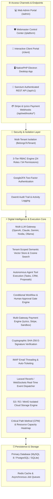

# 🧠 ADA Co-OS (NexusADA)

<div align="center">

[](https://github.com/adacreativeco/NexusADA/releases)
[](https://laravel.com/)
[](https://php.net/)
[](https://livewire.laravel.com/)
[](app/Services/AI/)
[](app/Services/Payment/)
[](app/Events/)
[](LICENSE)
[-success?style=for-the-badge&logo=php&logoColor=white)](tests/)
[](https://github.com/adacreativeco/NexusADA/stargazers)

<br/>

**Multi-Tenant Enterprise Operating System, Digital Intelligence & Agency Operations Platform.**

*Connects. Remembers. Analyzes.*

[English Documentation](README.md) • [🇹🇷 Türkçe Dokümantasyon](README.tr.md) • [📖 Case Study](https://adacreative.co/vaka-analizleri/nexus-ada)

</div>

---

> [!NOTE]
> ### 🛡️ Complete Enterprise Operations Platform (v1.2.0)
> ADA Co-OS (NexusADA) is an end-to-end multi-tenant corporate operating platform implementing row-level data isolation, 3-tier RBAC, a multi-provider AI gateway, vector semantic memory, conditional workflow execution, payment gateways (Iyzico, Stripe) with automated webhook handlers, cryptographic SHA-256 digital signatures, transactional HTML mailers, WebSocket broadcasting, tenant-isolated cloud storage, and Critical Path Method (CPM) project scheduling.

---

## 🏗️ System Architecture


```mermaid
flowchart TD
    subgraph ClientAccess["🌐 Access Channels & Endpoints"]
        WebAdmin["💻 Web Admin Portal (/admin)"]
        Webmaster["🛡️ Webmaster Control Center (/platform)"]
        ClientPortal["👥 Interactive Client Portal (/client)"]
        DesktopApp["🖥️ NativePHP Electron Desktop App"]
        RESTClients["📡 Sanctum Authenticated REST API (/api/v1)"]
        Webhooks["💳 Stripe & Iyzico Payment Webhooks (/api/webhooks/*)"]
    end

    subgraph SecurityLayer["🔐 Security & Isolation Layer"]
        TenantScope["Multi-Tenant Isolation (BelongsToTenant)"]
        RBAC["3-Tier RBAC Engine (24 Roles / 54 Permissions)"]
        TwoFactor["Google2FA Two-Factor Authentication"]
        AuditTrail["OwenIt Audit Trail & Activity Logging"]
    end

    subgraph CoreEngines["⚡ Digital Intelligence & Execution Core"]
        AIGateway["Multi-LLM Gateway (OpenAI, Claude, Gemini, Nvidia, Ollama)"]
        VectorStore["Tenant-Scoped Semantic Vector Store & Cosine Search"]
        ToolRegistry["Autonomous Agent Tool Execution (Tasks, CRM, Proposals)"]
        WorkflowDAG["Conditional Workflow & Human Approval Gate Engine"]
        PaymentEngine["Multi-Gateway Payment Engine (Iyzico, Stripe, Sandbox)"]
        DigitalSign["Cryptographic SHA-256 E-Signature Verification"]
        EmailIntel["IMAP Email Threading & Auto-Ticketing"]
        BroadcastEngine["Laravel Reverb / WebSockets Real-Time Event Dispatcher"]
        CloudStorage["S3 / R2 / MinIO Isolated Cloud Storage Engine"]
        CPMEngine["Critical Path Method (CPM) & Resource Capacity Heatmap"]
    end

    subgraph DataLayer["🗄️ Persistence & Storage"]
        MySQL["Primary Database (MySQL 8 / PostgreSQL / SQLite)"]
        Redis["Redis Cache & Asynchronous Job Queues"]
    end

    ClientAccess --> SecurityLayer
    SecurityLayer --> CoreEngines
    CoreEngines <--> DataLayer
```

---

## 🚀 Enterprise Modules & Capabilities

### 1. 🤖 Multi-LLM Gateway & Semantic RAG Vector Memory
- **Universal Provider Routing:** Pluggable AI gateway supporting **OpenAI (GPT-4o)**, **Anthropic (Claude 3.5 Sonnet)**, **Google (Gemini 2.0)**, **NVIDIA NIM**, and local **Ollama** with deterministic mock fallbacks.
- **Tenant-Scoped Vector Store:** Computes vector embeddings and performs cosine similarity search across corporate memories (`VectorStore.php`).
- **Autonomous Tool Calling:** Autonomous execution registry for agentic actions (`create_task`, `create_proposal`, `lookup_client`).

### 2. ⚡ Conditional DAG Workflows & Human Approval Gates
- **Dynamic Branching:** Evaluates record conditions (`>`, `<`, `==`, `contains`, `in`) to steer business processes dynamically (`ConditionEvaluator.php`).
- **Human-in-the-Loop:** Cryptographically signed approval gates for management sign-offs on budgets and proposals (`ApprovalGateService.php`).

### 3. 💳 Multi-Gateway Payments, Webhook Listeners & Cryptographic E-Signatures
- **Payment Processing:** Unified payment provider architecture supporting **Iyzico**, **Stripe**, and sandbox test gateways (`PaymentService.php`).
- **Automated Webhooks:** `/api/webhooks/stripe` and `/api/webhooks/iyzico` controllers verifying payloads and auto-reconciling invoices in real-time.
- **SHA-256 Digital Signatures:** Generates verifiable audit certificates capturing signer identity, IP, user agent, timestamp, and SHA-256 HMAC integrity hashes (`DigitalSignatureService.php`).

### 4. 📡 Real-Time WebSockets & Transactional Notifications
- **Event Broadcasting:** Event dispatcher broadcasting on tenant-scoped private WebSocket channels (`TaskUpdatedEvent`, `NotificationCreatedEvent`).
- **Transactional Mailers:** Automated HTML notifications on invoice collections (`InvoicePaidNotification`) and proposal deliveries (`ProposalSentNotification`).

### 5. 🎨 Interactive Client Pin-Annotation Canvas
- **Design Review Canvas (`AssetReviewer.php`):** Point-and-click pin placement on design assets, allowing clients to leave coordinate-based ($x, y$) threaded feedback.

### 6. 📅 Critical Path Method (CPM) & Resource Capacity Leveling
- **CPM Schedule Analysis:** Forward and backward pass calculation identifying project duration, early/late dates, total float/slack, and critical path task chains (`CriticalPathEngine.php`).
- **Workload Capacity Heatmap:** Tracks daily workload hours per employee, flagging over-allocation (>8h/day) to prevent team burnout (`ResourceAllocationService.php`).

---

## 📸 Visual Showcase

<div align="center">

### 📊 Modern Operations & Analytics Dashboard
*Executive overview with financial KPIs, project Gantt timelines, active tasks, and team utilization.*


<br/>

| 📁 Multi-Tenant Project Pipeline | 🤖 AI Assistant & Memory Core |
|:---:|:---:|
|  |  |
| *Task kanban boards, milestones, and client access.* | *Contextual business memory and prompt orchestration.* |

| 💼 Client Portal & Invoicing | ⚡ Workflow Automation Engine |
|:---:|:---:|
|  |  |
| *Self-service client portal, proposals & DomPDF reports.* | *Event-driven webhook dispatchers (Slack, Discord).* |

</div>

---

## 📡 REST API Reference

Sanctum-authenticated REST API endpoints available under `/api/v1`:

| Endpoint | Method | Description |
|---|---|---|
| `/api/v1/projects` | `GET`, `POST` | List and create multi-tenant projects. |
| `/api/v1/tasks` | `GET`, `POST`, `PUT`, `DELETE` | CRUD management for project tasks and milestones. |
| `/api/v1/clients` | `GET`, `POST`, `PUT` | Client CRM profiles, contacts, and billing terms. |
| `/api/v1/campaigns` | `GET`, `POST` | Marketing campaign tracking and budget utilization. |
| `/api/v1/reports` | `GET` | Generates aggregated analytics reports and metric summaries. |
| `/api/webhooks/stripe` | `POST` | Stripe checkout & charge webhook listener. |
| `/api/webhooks/iyzico` | `POST` | Iyzico 3D Secure / Direct payment webhook listener. |

---

## 🛠️ Quick Start

### 1. Clone & Install Dependencies
```bash
git clone https://github.com/adacreativeco/NexusADA.git
cd NexusADA
composer install
npm install && npm run build
```

### 2. Configure Environment
```bash
cp .env.example .env
php artisan key:generate
```

### 3. Run Database Migrations & Seeders
```bash
php artisan migrate --seed
```

### 4. Run Automated Test Suite (64 Tests, 141 Assertions)
```bash
php artisan test
```

### 5. Start Development Server
```bash
php artisan serve
```
Open [http://localhost:8000](http://localhost:8000) in your browser.

---

## 📄 License

Distributed under the Apache 2.0 License. See [LICENSE](LICENSE) for details.

---

<div align="center">
Built with 🧠 by <a href="https://github.com/adacreativeco">ADA Creative Co.</a>
</div>
