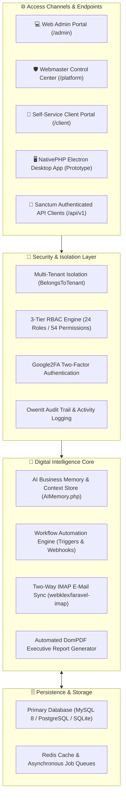

# 🧠 ADA Co-OS (NexusADA)

<div align="center">

[](https://github.com/adacreativeco/NexusADA/releases)
[](https://github.com/adacreativeco/NexusADA)
[](https://laravel.com/)
[](https://php.net/)
[](https://livewire.laravel.com/)
[](LICENSE)
[](tests/)
[](https://github.com/adacreativeco/NexusADA/stargazers)

<br/>

**Multi-Tenant Enterprise Operating System, Digital Intelligence & Agency Operations Platform.**

*Connects. Remembers. Analyzes.*

[English Documentation](README.md) • [🇹🇷 Türkçe Dokümantasyon](README.tr.md) • [📖 Case Study](https://adacreative.co/vaka-analizleri/nexus-ada)

</div>

---

> [!WARNING]
> ### ⚠️ Important Notice / Active Development & Prototype Status
> **This project is an open-source reference architecture and active development prototype.**
> Certain features showcased in promotional materials or landing pages may be in active development, operate in simulated/mock fallback mode (e.g. AI services when no API key is configured), or require specific external infrastructure setup (IMAP mail servers, Redis workers, NativePHP Electron builds).
> 
> *The project is provided "as is" under the Apache 2.0 License as an enterprise reference implementation.*

---

## 🎯 Overview

**ADA Co-OS (NexusADA)** is a corporate operations and digital intelligence platform engineered by **ADA Creative Co.** for creative agencies, consultancies, and multi-disciplinary teams. It explores the convergence of client relationships, project delivery, financial proposals, IMAP communications, workflow automations, and AI business memory in a row-level isolated multi-tenant architecture.

---

## 📊 Module Implementation & Readiness Status

| Module / Feature | Status | Description & Implementation Details |
|---|:---:|---|
| **Multi-Tenant Architecture** | 🟢 **Production Ready** | Row-level data isolation via `BelongsToTenant` trait, tenant scoping, and isolated workspace routing. |
| **3-Tier RBAC & 2FA** | 🟢 **Production Ready** | 24 roles, 54 permissions, Platform/Tenant scopes, and Google Authenticator TOTP 2FA. |
| **Webmaster Portal & Impersonation** | 🟢 **Production Ready** | `/platform` control center, tenant provisioning, plan configuration, and live session impersonation. |
| **Sanctum REST API (`/api/v1`)** | 🟢 **Production Ready** | Token-authenticated endpoints for projects, tasks, clients, campaigns, and reports. |
| **KVKK Compliance & Account Deletion** | 🟢 **Production Ready** | Self-service account anonymization, data JSON export, and audit-safe soft deletion. |
| **PWA & Mobile Manifest** | 🟢 **Production Ready** | Service worker caching, offline capability, and mobile app manifest. |
| **AI Intelligence & Memory Core** | 🟡 **Developer Preview / Mock Fallback** | `AIMemory.php` context store; uses NVIDIA/OpenAI API when keys are set, otherwise falls back to deterministic mock responses. |
| **Workflow Automations** | 🟡 **Developer Preview** | Event-driven trigger engine dispatching to Slack, Discord, and webhooks; advanced condition builder in progress. |
| **IMAP E-Mail Synchronization** | 🟡 **Requires Setup** | Two-way IMAP sync via `webklex/laravel-imap`; requires external mail credentials and background cron (`imap:sync`). |
| **Native Desktop App (Electron)** | 🛠️ **Prototype Build** | NativePHP / Electron scaffolding configured; requires local NativePHP build toolchain for Windows/macOS binary packaging. |

---

## 📸 Visual Showcase

<div align="center">

### 📊 Modern Operations & Analytics Dashboard
*Executive overview with financial KPIs, project Gantt timelines, active tasks, and team utilization.*


<br/>

| 📁 Multi-Tenant Project Pipeline | 🤖 AI Assistant & Memory Core |
|:---:|:---:|
|  |  |
| *Task kanban boards, milestones, and client access.* | *Contextual business memory and prompt orchestration.* |

| 💼 Client Portal & Invoicing | ⚡ Workflow Automation Engine |
|:---:|:---:|
|  |  |
| *Self-service client portal, proposals & DomPDF reports.* | *Event-driven webhook dispatchers (Slack, Discord).* |

</div>

---

## 🏗️ System Architecture


```mermaid
flowchart TD
    subgraph ClientAccess["🌐 Access Channels & Endpoints"]
        WebAdmin["💻 Web Admin Portal (/admin)"]
        Webmaster["🛡️ Webmaster Control Center (/platform)"]
        ClientPortal["👥 Self-Service Client Portal (/client)"]
        DesktopApp["🖥️ NativePHP Electron Desktop App (Prototype)"]
        RESTClients["📡 Sanctum Authenticated API Clients (/api/v1)"]
    end

    subgraph SecurityLayer["🔐 Security & Isolation Layer"]
        TenantScope["Multi-Tenant Isolation (BelongsToTenant)"]
        RBAC["3-Tier RBAC Engine (24 Roles / 54 Permissions)"]
        TwoFactor["Google2FA Two-Factor Authentication"]
        AuditTrail["OwenIt Audit Trail & Activity Logging"]
    end

    subgraph CoreServices["🧠 Digital Intelligence Core"]
        AIMemory["AI Business Memory & Context Store (AIMemory.php)"]
        Automation["Workflow Automation Engine (Triggers & Webhooks)"]
        ImapSync["Two-Way IMAP E-Mail Sync (webklex/laravel-imap)"]
        PdfEngine["Automated DomPDF Executive Report Generator"]
    end

    subgraph DataLayer["🗄️ Persistence & Storage"]
        MySQL["Primary Database (MySQL 8 / PostgreSQL / SQLite)"]
        Redis["Redis Cache & Asynchronous Job Queues"]
    end

    ClientAccess --> SecurityLayer
    SecurityLayer --> CoreServices
    CoreServices <--> DataLayer
```

---

## 🛠️ Quick Start (Developer Setup)

### Prerequisites
- PHP 8.2+ (with `pdo`, `sqlite3`, `curl`, `mbstring`, `intl` extensions)
- Composer
- Node.js & npm

### 1. Clone & Install Dependencies
```bash
git clone https://github.com/adacreativeco/NexusADA.git
cd NexusADA
composer install
npm install && npm run build
```

### 2. Configure Environment
```bash
cp .env.example .env
php artisan key:generate
```

### 3. Run Database Migrations & Seeders
```bash
php artisan migrate --seed
```

### 4. Run Automated Test Suite (55 Tests)
```bash
php artisan test
```

### 5. Start Development Server
```bash
php artisan serve
```
Open [http://localhost:8000](http://localhost:8000) in your browser.

---

## 📄 License

Distributed under the Apache 2.0 License. See [LICENSE](LICENSE) for details.

---

<div align="center">
Built with 🧠 by <a href="https://github.com/adacreativeco">ADA Creative Co.</a>
</div>
