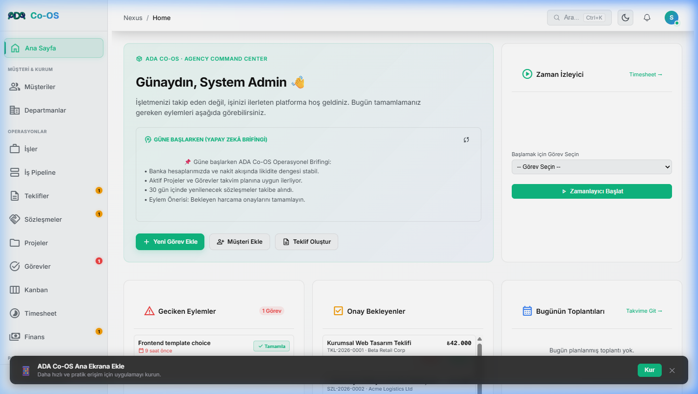
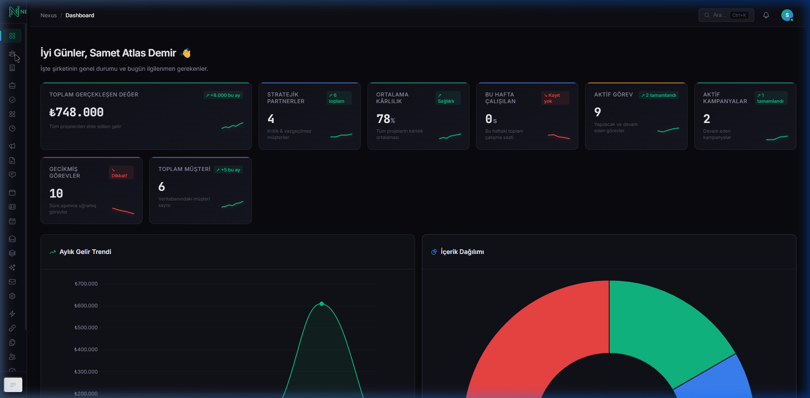
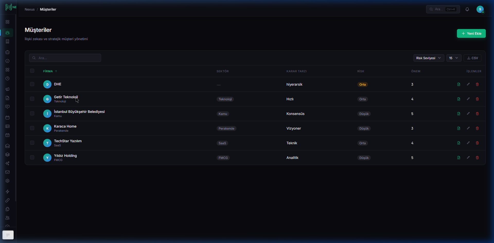
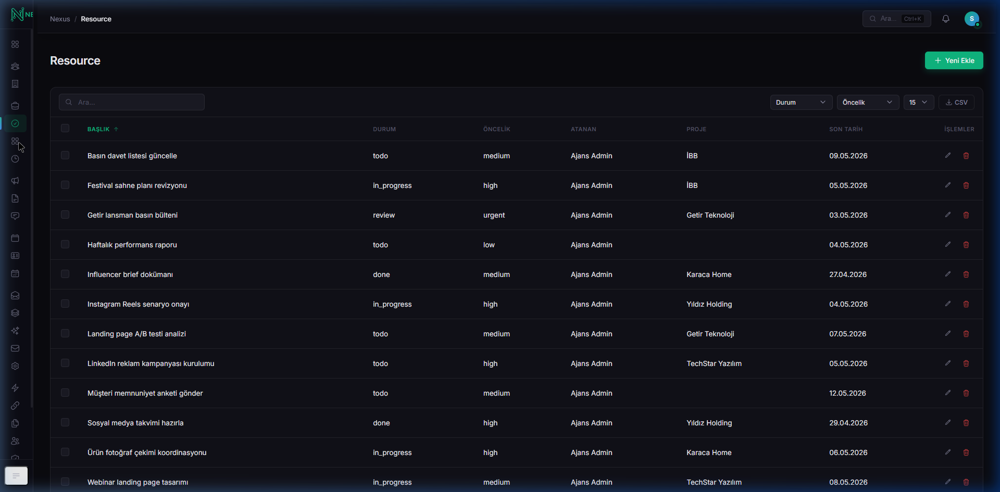
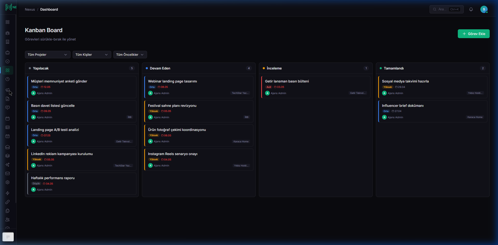

# 🧠 ADA Co-OS (NexusADA)

<div align="center">

[](https://github.com/adacreativeco/NexusADA/releases)
[](https://laravel.com/)
[](https://php.net/)
[](https://livewire.laravel.com/)
[](app/Services/AI/)
[](app/Services/Payment/)
[](app/Events/)
[](LICENSE)
[-success?style=for-the-badge&logo=php&logoColor=white)](tests/)
[](https://github.com/adacreativeco/NexusADA/stargazers)

<br/>

**Çok Kiracılı (Multi-Tenant) Kurumsal İşletim Sistemi, Dijital Zeka & Ajans Operasyon Platformu.**

*Bağlar. Hatırlatır. Analiz Eder.*

[🇹🇷 Türkçe Dokümantasyon](README.tr.md) • [🇺🇸 English Documentation](README.md) • [📖 Vaka Analizi](https://adacreative.co/vaka-analizleri/nexus-ada)

</div>

---

> [!NOTE]
> ### 🛡️ Tam Donanımlı Kurumsal Operasyon Platformu (v1.2.0)
> ADA Co-OS (NexusADA), satır düzeyinde çok kiracılı izolasyon, 3 katmanlı RBAC, çok sağlayıcılı yapay zeka ağ geçidi, vektör anlamsal hafıza, koşullu iş akışı yürütme, otomatik webhook dinleyicili ödeme ağ geçitleri (Iyzico, Stripe), kriptografik SHA-256 dijital imzalar, işlem e-postaları, WebSocket canlı yayınları, kiracıya özel bulut depolama ve Kritik Yol Yöntemi (CPM) proje planlama motorunu içeren uçtan uca bir kurumsal operasyon sistemidir.

---

## 🏗️ Sistem Mimarisi

```mermaid
flowchart TD
    subgraph ClientAccess["🌐 Erişim Kanalları & Uç Noktalar"]
        WebAdmin["💻 Web Yönetici Portali (/admin)"]
        Webmaster["🛡️ Webmaster Kontrol Merkezi (/platform)"]
        ClientPortal["👥 İnteraktif Müşteri Portali (/client)"]
        DesktopApp["🖥️ NativePHP Electron Masaüstü Uygulaması"]
        RESTClients["📡 Sanctum Kimlik Doğrulamalı REST API (/api/v1)"]
        Webhooks["💳 Stripe & Iyzico Ödeme Webhookları (/api/webhooks/*)"]
    end

    subgraph SecurityLayer["🔐 Güvenlik & İzolasyon Katmanı"]
        TenantScope["Çok Kiracılı İzolasyon (BelongsToTenant)"]
        RBAC["3 Katmanlı RBAC Motoru (24 Rol / 54 İzin)"]
        TwoFactor["Google2FA İki Aşamalı Doğrulama"]
        AuditTrail["OwenIt Denetim İzi & Aktivite Kayıtları"]
    end

    subgraph CoreEngines["⚡ Dijital Zeka & Yürütme Çekirdeği"]
        AIGateway["Çoklu LLM Ağ Geçidi (OpenAI, Claude, Gemini, Nvidia, Ollama)"]
        VectorStore["Kiracı Kapsamlı Anlamsal Vektör Deposu & Kosinüs Araması"]
        ToolRegistry["Otonom Ajan Araç Yürütme (Görevler, CRM, Teklifler)"]
        WorkflowDAG["Koşullu İş Akışı & İnsan Onay Kapısı Motoru"]
        PaymentEngine["Çok Sağlayıcılı Ödeme Motoru (Iyzico, Stripe, Sandbox)"]
        DigitalSign["Kriptografik SHA-256 E-İmza Doğrulaması"]
        EmailIntel["IMAP E-posta Zincirleme & Otomatik Biletleme"]
        BroadcastEngine["Laravel Reverb / WebSockets Canlı Olay Dağıtıcısı"]
        CloudStorage["S3 / R2 / MinIO İzole Bulut Depolama Motoru"]
        CPMEngine["Kritik Yol Yöntemi (CPM) & Kaynak Kapasite Isı Haritası"]
    end

    subgraph DataLayer["🗄️ Veritabanı & Kalıcılık"]
        MySQL["Ana Veritabanı (MySQL 8 / PostgreSQL / SQLite)"]
        Redis["Redis Önbellek & Asenkron İş Kuyrukları"]
    end

    ClientAccess --> SecurityLayer
    SecurityLayer --> CoreEngines
    CoreEngines <--> DataLayer
```



---

## 🚀 Öne Çıkan Kurumsal Yetenekler

### 1. 🤖 Çoklu LLM Ağ Geçidi & Anlamsal RAG Vektör Hafızası
- **Evrensel Sağlayıcı Yönlendirmesi:** **OpenAI (GPT-4o)**, **Anthropic (Claude 3.5 Sonnet)**, **Google (Gemini 2.0)**, **NVIDIA NIM** ve yerel **Ollama** destekli yapay zeka ağ geçidi.
- **Kiracı Kapsamlı Vektör Deposu:** Kurumsal hafızalar üzerinde kosinüs benzerliği ile anlamsal arama (`VectorStore.php`).
- **Otonom Araç Çağırma:** Görev açma, teklif taslağı hazırlama ve müşteri geçmişi sorgulama araçları (`AIToolRegistry.php`).

### 2. ⚡ Koşullu İş Akışları & İnsan Onay Kapıları (Human-in-the-Loop)
- **Dinamik Dallanma:** Süreçleri bütçe, durum ve özel koşullara göre dallandırma (`ConditionEvaluator.php`).
- **Yönetici Onay Kapısı:** Kriptografik tokenlar ile bütçe ve tekliflerde yönetici imza adımları (`ApprovalGateService.php`).

### 3. 💳 Çoklu Ödeme Ağ Geçitleri, Webhook Dinleyicileri & Kriptografik E-İmza
- **Ödeme İşleme:** **Iyzico**, **Stripe** ve güvenli sandbox sürücüleri (`PaymentService.php`).
- **Otomatik Webhooklar:** `/api/webhooks/stripe` ve `/api/webhooks/iyzico` uç noktaları ile gelen ödemeleri anında faturaya işleyip kapatma.
- **SHA-256 Dijital İmza:** İmzacı kimliği, IP adresi, zaman damgası ve HMAC-SHA256 doğrulama sertifikası (`DigitalSignatureService.php`).

### 4. 📡 Canlı WebSockets & İşlem E-Posta Bildirimleri
- **Canlı Yayın (Broadcasting):** Kiracıya özel gizli kanallardan anlık görev ve bildirim yayınlama (`TaskUpdatedEvent`, `NotificationCreatedEvent`).
- **İşlem E-Postaları:** Fatura tahsilatında (`InvoicePaidNotification`) ve teklif gönderiminde (`ProposalSentNotification`) otomatik HTML bildirimleri.

### 5. 🎨 İnteraktif Tasarım İnceleme & Pin Bırakma Tuvali
- **Görsel Revizyon Tuvali (`AssetReviewer.php`):** Müşterinin tasarım dosyaları üzerine tıklayıp koordinat bazlı ($x, y$) nokta atışı pin bırakıp yorum yazabildiği interaktif inceleme ekranı.

### 6. 📅 Kritik Yol Yöntemi (CPM) & Kaynak Dengeleme
- **CPM Zaman Çizelgelemesi:** Erken/geç başlangıç ve bitiş hesaplamaları, toplam bolluk/esneklik ve kritik yol görev zinciri tespiti (`CriticalPathEngine.php`).
- **Kapasite & Aşırı Yük Isı Haritası:** Çalışanların günlük çalışma saatlerini izleyerek 8 saat üzerindeki aşırı yüklenmeleri kırmızı bayrakla uyarır (`ResourceAllocationService.php`).

---

## 📸 Görsel Vitrin

<div align="center">

### 📊 Modern Operasyon & Analitik Kontrol Paneli
*Finansal KPI'lar, Gantt proje zaman çizelgeleri, aktif görevler ve ekip kapasitesini gösteren yönetici paneli.*


<br/>

| 📁 Çok Kiracılı Proje Akışı | 🤖 Yapay Zeka Asistanı & Hafıza Çekirdeği |
|:---:|:---:|
|  |  |
| *Görev kanban panoları, kilometre taşları ve müşteri yetkilendirmesi.* | *Bağlamsal kurumsal hafıza ve istem orkestrasyonu.* |

| 💼 Müşteri Portali & Faturalandırma | ⚡ İş Akışı Otomasyon Motoru |
|:---:|:---:|
|  |  |
| *Self-servis müşteri portali, teklifler ve DomPDF raporları.* | *Olay güdümlü webhook dağıtıcıları (Slack, Discord).* |

</div>

---

## 📡 REST API Referansı

Sanctum ile korunan `/api/v1` uç noktaları:

| Uç Nokta | Metot | Açıklama |
|---|---|---|
| `/api/v1/projects` | `GET`, `POST` | Çok kiracılı projeleri listeler ve yeni proje oluşturur. |
| `/api/v1/tasks` | `GET`, `POST`, `PUT`, `DELETE` | Proje görevleri ve kilometre taşlarını yönetir. |
| `/api/v1/clients` | `GET`, `POST`, `PUT` | Müşteri profilleri, yetkililer ve fatura koşulları. |
| `/api/v1/campaigns` | `GET`, `POST` | Pazarlama kampanyası takibi ve bütçe kullanımı. |
| `/api/v1/reports` | `GET` | Toplu analitik raporları ve metrik özetleri üretir. |
| `/api/webhooks/stripe` | `POST` | Stripe ödeme oturumu ve tahsilat webhook dinleyicisi. |
| `/api/webhooks/iyzico` | `POST` | Iyzico doğrudan / 3D Secure ödeme webhook dinleyicisi. |

---

## 🛠️ Hızlı Başlangıç

### 1. Repoyu Klonlayın ve Bağımlılıkları Yükleyin
```bash
git clone https://github.com/adacreativeco/NexusADA.git
cd NexusADA
composer install
npm install && npm run build
```

### 2. Ortamı Yapılandırın
```bash
cp .env.example .env
php artisan key:generate
```

### 3. Veritabanı Göçlerini ve Başlangıç Verilerini Yükleyin
```bash
php artisan migrate --seed
```

### 4. Otomatik Test Paketini Çalıştırın (64 Test, 141 Doğrulama)
```bash
php artisan test
```

### 5. Yerel Sunucuyu Başlatın
```bash
php artisan serve
```
Tarayıcınızda [http://localhost:8000](http://localhost:8000) adresini açın.

---

## 📄 Lisans

Apache 2.0 Lisansı ile dağıtılmaktadır. Detaylar için [LICENSE](LICENSE) dosyasına bakabilirsiniz.

---

<div align="center">
🧠 <a href="https://github.com/adacreativeco">ADA Creative Co.</a> tarafından geliştirilmiştir.
</div>
