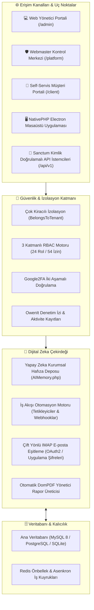

# 🧠 ADA Co-OS (NexusADA)

<div align="center">

[](https://laravel.com/)
[](https://php.net/)
[](https://livewire.laravel.com/)
[](https://nativephp.com/)
[](https://tailwindcss.com/)
[](LICENSE)
[](tests/)
[](https://github.com/adacreativeco/NexusADA/stargazers)
[](https://github.com/adacreativeco/NexusADA/releases)

<br/>

**Çok Kiracılı (Multi-Tenant) Kurumsal İşletim Sistemi, Dijital Zeka & Ajans Operasyon Platformu.**

*Bağlar. Hatırlatır. Analiz Eder.*

[🇹🇷 Türkçe Dokümantasyon](README.tr.md) • [🇺🇸 English Documentation](README.md) • [📖 Vaka Analizi](https://adacreative.co/vaka-analizleri/nexus-ada)

</div>

---

**ADA Co-OS (NexusADA)**, **ADA Creative Co.** tarafından yaratıcı ajanslar, danışmanlık firmaları ve kurumsal iletişim ekipleri için geliştirilmiş hepsi bir arada dijital zeka ve kurumsal yönetim platformudur. Müşteri ilişkileri, proje teslimatı, finansal teklifler, IMAP e-posta iletişimi, iş akışı otomasyonları ve kurumsal yapay zeka hafızasını satır düzeyinde izole edilmiş çok kiracılı (**Multi-Tenant**) tek bir sistemde ve bağımsız masaüstü uygulamasıyla bir araya getirir.

---

## 📸 Görsel Vitrin

<div align="center">

### 📊 Modern Operasyon & Analitik Kontrol Paneli
*Finansal KPI'lar, Gantt proje zaman çizelgeleri, aktif görevler ve ekip kapasitesini gösteren yönetici paneli.*


<br/>

| 📁 Çok Kiracılı Proje Akışı | 🤖 Yapay Zeka Asistanı & Hafıza Çekirdeği |
|:---:|:---:|
|  |  |
| *Görev kanban panoları, kilometre taşları ve müşteri yetkilendirmesi.* | *Bağlamsal kurumsal hafıza ve istem orkestrasyonu.* |

| 💼 Müşteri Portali & Faturalandırma | ⚡ İş Akışı Otomasyon Motoru |
|:---:|:---:|
|  |  |
| *Self-servis müşteri portali, teklifler ve DomPDF raporları.* | *Olay güdümlü webhook dağıtıcıları (Slack, Discord).* |

</div>

---

## 🏗️ Sistem Mimarisi



---

## 🚀 Öne Çıkan Yetenekler

### 1. 🏢 Satır Düzeyinde Çok Kiracılı (Multi-Tenant) Mimari
- Global sorgu filtrelemesi ile izole edilmiş organizasyon ve çalışma alanları (`BelongsToTenant` özelliği).
- Platform sahibi için `/platform` webmaster paneli, plan yönetimi ve herhangi bir kiracının gözünden sistemi görmeyi sağlayan **Impersonate (Kimliğe Bürünme)** modu.

### 2. 🛡️ 3 Katmanlı Kurumsal RBAC (24 Rol / 54 İzin)
- Platform, Kiracı ve Çalışma Alanı düzeyinde detaylı yetkilendirme.
- Yöneticiler için Google Authenticator ile zorunlu iki aşamalı doğrulama (2FA).

### 3. 🤖 Yapay Zeka Kurumsal Hafızası & Günlük Brifingler
- Kurumsal bilgi birikimini, müşteri tercihlerini ve geçmiş kararları saklayan bağlamsal hafıza motoru (`AIMemory.php`).
- Ekip ilerlemesini, yaklaşan teslim tarihlerini ve riskleri derleyen otomatik günlük yönetici brifingleri.

### 4. ⚡ İş Akışı Otomasyon Motoru
- Proje tamamlanması, fatura onayı veya teslim tarihi gecikmesi gibi olaylarda **Slack**, **Discord** veya özel webhook uç noktalarına anında bildirim gönderen tetikleyici motoru.

### 5. 📧 Çift Yönlü IMAP E-Posta Entegrasyonu
- Şifrelenmiş kimlik bilgileriyle müşteri e-posta yazışmalarını doğrudan ilgili proje zaman tüneline bağlayan güvenli IMAP bağlayıcısı.

### 6. 📄 Otomatik PDF Yönetici Raporlaması
- Müşteri teklifleri, proje retrospektifleri ve kampanya denetimlerini DomPDF ile tek tıkla profesyonel PDF formatında indirme.

### 7. 🖥️ Masaüstü Uygulaması (NativePHP / Electron)
- İnternet kesintilerinde bile çalışan, yerel pencere kontrolleri ve masaüstü bildirimleri sunan bağımsız Windows kurulum paketi (`~106 MB`).

---

## 📡 REST API Referansı

Sanctum ile korunan `/api/v1` uç noktaları:

| Uç Nokta | Metot | Açıklama |
|---|---|---|
| `/api/v1/projects` | `GET`, `POST` | Çok kiracılı projeleri listeler ve yeni proje oluşturur. |
| `/api/v1/tasks` | `GET`, `POST`, `PUT`, `DELETE` | Proje görevleri ve kilometre taşlarını yönetir. |
| `/api/v1/clients` | `GET`, `POST`, `PUT` | Müşteri profilleri, yetkililer ve fatura koşulları. |
| `/api/v1/campaigns` | `GET`, `POST` | Pazarlama kampanyası takibi ve bütçe kullanımı. |
| `/api/v1/reports` | `GET` | Toplu analitik raporları ve metrik özetleri üretir. |

---

## 🛠️ Hızlı Başlangıç

### Gereksinimler
- PHP 8.2+ (`pdo`, `sqlite3`, `curl`, `mbstring`, `intl` eklentileriyle)
- Composer
- Node.js & npm

### 1. Repoyu Klonlayın ve Bağımlılıkları Yükleyin
```bash
git clone https://github.com/adacreativeco/NexusADA.git
cd NexusADA
composer install
npm install && npm run build
```

### 2. Ortamı Yapılandırın
```bash
cp .env.example .env
php artisan key:generate
```

### 3. Veritabanı Göçlerini ve Başlangıç Verilerini Yükleyin
```bash
php artisan migrate --seed
```

### 4. Otomatik Test Paketini Çalıştırın (55 Test)
```bash
php artisan test
```

### 5. Yerel Sunucuyu Başlatın
```bash
php artisan serve
```
Tarayıcınızda [http://localhost:8000](http://localhost:8000) adresini açın.

---

## 📂 Proje Yapısı

```
nexus-ada/
├── app/
│   ├── Admin/Resources/           # Filament/Nexus tablo kaynak yapılandırmaları
│   ├── Console/Commands/          # Artisan CLI komutları (IMAP senkronizasyonu vb.)
│   ├── Http/Controllers/          # Web, API ve dışa aktarım kontrolcüleri
│   ├── Http/Middleware/           # Çok kiracılı yapı, 2FA ve güvenlik başlıkları
│   ├── Livewire/                  # Reaktif Livewire 3 bileşenleri (Admin, Client, Platform)
│   ├── Models/                    # BelongsToTenant özellikli Eloquent modelleri
│   ├── Observers/                 # Denetim izi ve durum değişikliği gözlemcileri
│   └── Services/                  # Yapay zeka zekası, IMAP, otomasyon & PDF motoru
├── config/                        # Laravel çekirdek ve paket yapılandırma dosyaları
├── database/
│   ├── migrations/                # Veritabanı şema göçleri
│   └── seeders/                   # Rol, izin ve varsayılan kiracı tohumlayıcıları
├── public/images/                 # Marka görselleri ve önizleme ekran görüntüleri
├── resources/views/               # Koyu temalı Blade şablonları
├── routes/                        # Web, API ve konsol rota tanımları
└── tests/
    ├── Feature/                   # 54 özellik testi (Auth, RBAC, Multi-Tenant, API)
    └── Unit/                      # Birim test paketi (toplam 55 test, 104 doğrulama)
```

---

## 📄 Lisans

Apache 2.0 Lisansı ile dağıtılmaktadır. Detaylar için [LICENSE](LICENSE) dosyasına bakabilirsiniz.

---

<div align="center">
🧠 <a href="https://github.com/adacreativeco">ADA Creative Co.</a> tarafından geliştirilmiştir.
</div>
