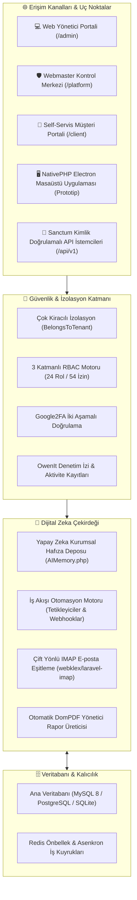

# 🧠 ADA Co-OS (NexusADA)

<div align="center">

[](https://github.com/adacreativeco/NexusADA/releases)
[](https://github.com/adacreativeco/NexusADA)
[](https://laravel.com/)
[](https://php.net/)
[](https://livewire.laravel.com/)
[](LICENSE)
[](tests/)
[](https://github.com/adacreativeco/NexusADA/stargazers)

<br/>

**Çok Kiracılı (Multi-Tenant) Kurumsal İşletim Sistemi, Dijital Zeka & Ajans Operasyon Platformu.**

*Bağlar. Hatırlatır. Analiz Eder.*

[🇹🇷 Türkçe Dokümantasyon](README.tr.md) • [🇺🇸 English Documentation](README.md) • [📖 Vaka Analizi](https://adacreative.co/vaka-analizleri/nexus-ada)

</div>

---

> [!WARNING]
> ### ⚠️ Önemli Uyarı / Aktif Geliştirme & Prototip Durumu
> **Bu proje açık kaynaklı bir referans mimarisi ve aktif geliştirme aşamasında olan bir prototiptir.**  
> Tanıtım sayfalarında veya arayüzlerde yer alan bazı özellikler aktif geliştirme sürecindedir, harici API anahtarı girilmediğinde simüle/mock modunda çalışmaktadır (örneğin yapay zeka hafıza servisi) veya harici altyapı kurulumu gerektirmektedir (IMAP posta sunucuları, Redis iş kuyrukları, NativePHP masaüstü derleyicileri).
> 
> *Proje, Apache 2.0 Lisansı altında kurumsal bir referans uygulaması olarak olduğu gibi ("as is") sunulmaktadır.*

---

## 🎯 Genel Bakış

**ADA Co-OS (NexusADA)**, **ADA Creative Co.** tarafından ajanslar, danışmanlık firmaları ve kurumsal ekipler için geliştirilen; müşteri ilişkileri, proje teslimatı, teklifler, IMAP iletişimi, otomasyonlar ve kurumsal yapay zeka hafızasını satır düzeyinde izole edilmiş çok kiracılı (**Multi-Tenant**) tek bir sistemde birleştiren kurumsal bir dijital zeka platformudur.

---

## 📊 Modül Geliştirme & Hazırlık Durumu

| Modül / Özellik | Durum | Açıklama & Uygulama Detayı |
|---|:---:|---|
| **Çok Kiracılı Mimari (Multi-Tenant)** | 🟢 **Üretime Hazır** | `BelongsToTenant` özelliği ile satır düzeyinde veri izolasyonu, tenant scoping ve izole çalışma alanları. |
| **3 Katmanlı RBAC & 2FA** | 🟢 **Üretime Hazır** | 24 rol, 54 izin, Platform/Tenant kapsamları ve Google Authenticator TOTP iki aşamalı doğrulama. |
| **Webmaster Paneli & Impersonate** | 🟢 **Üretime Hazır** | `/platform` kontrol merkezi, kiracı yönetimi, plan ayarları ve canlı kiracı kimliğine bürünme modu. |
| **Sanctum REST API (`/api/v1`)** | 🟢 **Üretime Hazır** | Projeler, görevler, müşteriler, kampanyalar ve raporlar için token korumalı uç noktalar. |
| **KVKK Uyumu & Hesap Silme** | 🟢 **Üretime Hazır** | Kullanıcı kendi hesabını anonimleştirerek silebilir, JSON formatında verilerini dışa aktarabilir. |
| **PWA & Mobil Uyum** | 🟢 **Üretime Hazır** | Service worker önbelleklemesi, çevrimdışı çalışma desteği ve manifest.json. |
| **Yapay Zeka Hafıza & Asistanı** | 🟡 **Önizleme / Mock Fallback** | `AIMemory.php` kurumsal hafıza deposu; API anahtarı tanımlanmadığında simüle mock yanıt döner. |
| **İş Akışı Otomasyonları** | 🟡 **Önizleme Aşamasında** | Slack, Discord ve webhooklara bildirim gönderen tetikleyici motoru; gelişmiş koşul editörü geliştirilmektedir. |
| **IMAP E-Posta Senkronizasyonu** | 🟡 **Kurulum Gerektirir** | `webklex/laravel-imap` tabanlı çift yönlü e-posta eşitleme; harici posta hesabı ve `imap:sync` cronu gerektirir. |
| **Masaüstü Uygulaması (Electron)** | 🛠️ **Prototip İskeleti** | NativePHP / Electron yapılandırması hazırdır; Windows/macOS binary derlemesi için NativePHP derleme ortamı gerekir. |

---

## 📸 Görsel Vitrin

<div align="center">

### 📊 Modern Operasyon & Analitik Kontrol Paneli
*Finansal KPI'lar, Gantt proje zaman çizelgeleri, aktif görevler ve ekip kapasitesini gösteren yönetici paneli.*


<br/>

| 📁 Çok Kiracılı Proje Akışı | 🤖 Yapay Zeka Asistanı & Hafıza Çekirdeği |
|:---:|:---:|
|  |  |
| *Görev kanban panoları, kilometre taşları ve müşteri yetkilendirmesi.* | *Bağlamsal kurumsal hafıza ve istem orkestrasyonu.* |

| 💼 Müşteri Portali & Faturalandırma | ⚡ İş Akışı Otomasyon Motoru |
|:---:|:---:|
|  |  |
| *Self-servis müşteri portali, teklifler ve DomPDF raporları.* | *Olay güdümlü webhook dağıtıcıları (Slack, Discord).* |

</div>

---

## 🏗️ Sistem Mimarisi



---

## 🛠️ Hızlı Başlangıç (Geliştirici Kurulumu)

### Gereksinimler
- PHP 8.2+ (`pdo`, `sqlite3`, `curl`, `mbstring`, `intl` eklentileriyle)
- Composer
- Node.js & npm

### 1. Repoyu Klonlayın ve Bağımlılıkları Yükleyin
```bash
git clone https://github.com/adacreativeco/NexusADA.git
cd NexusADA
composer install
npm install && npm run build
```

### 2. Ortamı Yapılandırın
```bash
cp .env.example .env
php artisan key:generate
```

### 3. Veritabanı Göçlerini ve Başlangıç Verilerini Yükleyin
```bash
php artisan migrate --seed
```

### 4. Otomatik Test Paketini Çalıştırın (55 Test)
```bash
php artisan test
```

### 5. Yerel Sunucuyu Başlatın
```bash
php artisan serve
```
Tarayıcınızda [http://localhost:8000](http://localhost:8000) adresini açın.

---

## 📄 Lisans

Apache 2.0 Lisansı ile dağıtılmaktadır. Detaylar için [LICENSE](LICENSE) dosyasına bakabilirsiniz.

---

<div align="center">
🧠 <a href="https://github.com/adacreativeco">ADA Creative Co.</a> tarafından geliştirilmiştir.
</div>
