# 🧠 ADA Co-OS (NexusADA)

<div align="center">

[](https://github.com/adacreativeco/NexusADA/releases)
[](https://laravel.com/)
[](https://php.net/)
[](docker-compose.yml)
[](https://livewire.laravel.com/)
[](app/Services/AI/)
[](app/Services/Payment/)
[](resources/js/echo.js)
[](LICENSE)
[-success?style=for-the-badge&logo=php&logoColor=white)](tests/)
[](https://github.com/adacreativeco/NexusADA/stargazers)

<br/>

**Çok Kiracılı (Multi-Tenant) Kurumsal İşletim Sistemi, Dijital Zeka & Ajans Operasyon Platformu.**

*Bağlar. Hatırlatır. Analiz Eder.*

[🇹🇷 Türkçe Dokümantasyon](README.tr.md) • [🇺🇸 English Documentation](README.md) • [📖 Vaka Analizi](https://adacreative.co/vaka-analizleri/nexus-ada)

</div>

---

> [!NOTE]
> ### 🛡️ Kurumsal Referans & Kendi Sunucunuzda Barındırılabilir Platform (v1.3.0)
> ADA Co-OS (NexusADA), tek komutla Docker Compose kurulumu, Nginx ters vekil sunucusu, MySQL 8, Redis kuyrukları, Reverb WebSocket canlı yayını, satır düzeyinde çok kiracılı izolasyon, 3 katmanlı RBAC, çok sağlayıcılı yapay zeka ağ geçidi, vektör anlamsal hafıza, koşullu iş akışı yürütme, ödeme webhookları (Iyzico, Stripe), SHA-256 dijital imzalar, işlem e-postaları, interaktif tasarım revizyon tuvali ve Kritik Yol Yöntemi (CPM) proje planlama motorunu içeren eksiksiz bir kurumsal platformdur.

---

## 🏗️ Sistem Mimarisi

```mermaid
flowchart TD
    subgraph ClientAccess["🌐 Erişim Kanalları & Uç Noktalar"]
        WebAdmin["💻 Web Yönetici Portali (/admin)"]
        Webmaster["🛡️ Webmaster Kontrol Merkezi (/platform)"]
        ClientPortal["👥 İnteraktif Müşteri Portali (/client)"]
        DesktopApp["🖥️ NativePHP Electron Masaüstü Uygulaması"]
        RESTClients["📡 Sanctum Kimlik Doğrulamalı REST API (/api/v1)"]
        Webhooks["💳 Stripe & Iyzico Ödeme Webhookları (/api/webhooks/*)"]
    end

    subgraph SecurityLayer["🔐 Güvenlik & İzolasyon Katmanı"]
        TenantScope["Çok Kiracılı İzolasyon (BelongsToTenant)"]
        RBAC["3 Katmanlı RBAC Motoru (24 Rol / 54 İzin)"]
        TwoFactor["Google2FA İki Aşamalı Doğrulama"]
        AuditTrail["OwenIt Denetim İzi & Aktivite Kayıtları"]
    end

    subgraph CoreEngines["⚡ Dijital Zeka & Yürütme Çekirdeği"]
        AIGateway["Çoklu LLM Ağ Geçidi (OpenAI, Claude, Gemini, Nvidia, Ollama)"]
        VectorStore["Kiracı Kapsamlı Anlamsal Vektör Deposu & Kosinüs Araması"]
        ToolRegistry["Otonom Ajan Araç Yürütme (Görevler, CRM, Teklifler)"]
        WorkflowDAG["Koşullu İş Akışı & İnsan Onay Kapısı Motoru"]
        PaymentEngine["Çok Sağlayıcılı Ödeme Motoru (Iyzico, Stripe, Sandbox)"]
        DigitalSign["Kriptografik SHA-256 E-İmza Doğrulaması"]
        EmailIntel["IMAP E-posta Zincirleme & Otomatik Biletleme"]
        BroadcastEngine["Laravel Reverb / WebSockets Canlı Olay Dağıtıcısı"]
        CloudStorage["S3 / R2 / MinIO İzole Bulut Depolama Motoru"]
        CPMEngine["Kritik Yol Yöntemi (CPM) & Kaynak Kapasite Isı Haritası"]
    end

    subgraph ContainerLayer["🐳 Docker Kendi Sunucunuzda Barındırma Katmanı"]
        Nginx["Nginx Ters Vekil Sunucusu & Güvenlik Başlıkları"]
        AppFPM["PHP 8.4-FPM Optimize Konteyner"]
        QueueWorker["Arka Plan Redis Asenkron Kuyruk İşleyicisi"]
        ReverbServer["Reverb Canlı WebSocket Daemon Sunucusu (Port 8080)"]
        MySQL["MySQL 8.4 İzole Veritabanı Servisi"]
        Redis["Redis Bellek İçi Önbellek & Oturum Yönetimi"]
    end

    ClientAccess --> SecurityLayer
    SecurityLayer --> CoreEngines
    CoreEngines <--> ContainerLayer
```



---

## 🚀 Öne Çıkan Modüller & Kurumsal Yetenekler

### 1. 🐳 Tek Komutla Docker Kurulum Paketi
- **Eksiksiz Compose Mimarisi:** `docker-compose.yml` ile PHP 8.4-FPM, Nginx, MySQL 8.4, Redis, arka plan kuyruk işleyicileri ve Reverb WebSocket sunucusunu tek komutla ayağa kaldırır.
- **Kesintisiz Dağıtım Betiği:** Otomatik göçler, önbellekleme ve kuyruk yeniden başlatmayı yöneten `deploy.sh` betiği.

### 2. 🤖 Çoklu LLM Ağ Geçidi & Anlamsal RAG Vektör Hafızası
- **Evrensel Sağlayıcı Yönlendirmesi:** **OpenAI (GPT-4o)**, **Anthropic (Claude 3.5 Sonnet)**, **Google (Gemini 2.0)**, **NVIDIA NIM** ve yerel **Ollama** destekli yapay zeka ağ geçidi.
- **Kiracı Kapsamlı Vektör Deposu:** Kurumsal hafızalar üzerinde kosinüs benzerliği ile anlamsal arama (`VectorStore.php`).
- **Otonom Araç Çağırma:** Görev açma, teklif taslağı hazırlama ve müşteri geçmişi sorgulama araçları (`AIToolRegistry.php`).

### 3. ⚡ Koşullu İş Akışları & İnsan Onay Kapıları (Human-in-the-Loop)
- **Dinamik Dallanma:** Süreçleri bütçe, durum ve özel koşullara göre dallandırma (`ConditionEvaluator.php`).
- **Yönetici Onay Kapısı:** Kriptografik tokenlar ile bütçe ve tekliflerde yönetici imza adımları (`ApprovalGateService.php`).

### 4. 💳 Çoklu Ödeme Ağ Geçitleri, Webhook Dinleyicileri & Kriptografik E-İmza
- **Ödeme İşleme:** **Iyzico**, **Stripe** ve güvenli sandbox sürücüleri (`PaymentService.php`).
- **Otomatik Webhooklar:** `/api/webhooks/stripe` ve `/api/webhooks/iyzico` uç noktaları ile gelen ödemeleri anında faturaya işleyip kapatma.
- **SHA-256 Dijital İmza:** İmzacı kimliği, IP adresi, zaman damgası ve HMAC-SHA256 doğrulama sertifikası (`DigitalSignatureService.php`).

### 5. 📡 Canlı WebSockets & İşlem E-Posta Bildirimleri
- **Canlı Yayın (Broadcasting):** Kiracıya özel gizli kanallardan anlık görev ve bildirim yayınlama (`TaskUpdatedEvent`, `NotificationCreatedEvent`).
- **İstemci Echo Entegrasyonu:** `resources/js/echo.js` ile arayüzün sayfa yenilenmeden canlı güncellenmesi.
- **İşlem E-Postaları:** Fatura tahsilatında (`InvoicePaidNotification`) ve teklif gönderiminde (`ProposalSentNotification`) otomatik HTML bildirimleri.

### 6. 🎨 İnteraktif Tasarım İnceleme & Pin Bırakma Tuvali
- **Görsel Revizyon Tuvali (`AssetReviewer.php`):** Müşterinin tasarım dosyaları üzerine tıklayıp koordinat bazlı ($x, y$) nokta atışı pin bırakıp yorum yazabildiği interaktif inceleme ekranı.

### 7. 📅 Kritik Yol Yöntemi (CPM) & Kaynak Dengeleme
- **CPM Zaman Çizelgelemesi:** Erken/geç başlangıç ve bitiş hesaplamaları, toplam bolluk/esneklik ve kritik yol görev zinciri tespiti (`CriticalPathEngine.php`).
- **Kapasite & Aşırı Yük Isı Haritası:** Çalışanların günlük çalışma saatlerini izleyerek 8 saat üzerindeki aşırı yüklenmeleri kırmızı bayrakla uyarır (`ResourceAllocationService.php`).

---

## 📸 Arayüz Galerisi (Visual Showcase)

<div align="center">

### 📊 Modern Operasyon ve Analitik Dashboard'u
*Finansal KPI'lar, proje zaman çizelgeleri, aktif görevler ve AI operasyon brifingiyle yönetim merkezi.*


<br/>

| 📋 İnteraktif Görev Kanban Panosu | 💼 İş ve Süreç Takip Pipeline'ı |
|:---:|:---:|
|  |  |
| *Durum kolonları, öncelik rozetleri ve doğrudan görev atamaları.* | *Fırsat aşamaları, pipeline ciro değerleri ve canlı aktivite akışı.* |

| 💼 Müşteri Portali & Faturalama | 📅 Proje Gantt Zaman Çizelgesi |
|:---:|:---:|
|  |  |
| *Self-servis müşteri girişi, teklifler ve DomPDF raporları.* | *Gün/hafta ölçeğinde interaktif proje takvimi.* |

</div>

---

## 🛠️ Hızlı Başlangıç & Dağıtım

### Seçenek A: 🐳 Docker Compose (Prodüksiyon İçin Önerilen)
```bash
git clone https://github.com/adacreativeco/NexusADA.git
cd NexusADA
docker compose up -d --build
```
Sisteminiz [http://localhost](http://localhost) üzerinde anında yayında!

---

### Seçenek B: Yerel Geliştirme (PHP 8.3+ & SQLite)
```bash
git clone https://github.com/adacreativeco/NexusADA.git
cd NexusADA
composer install
npm install && npm run build
cp .env.example .env
php artisan key:generate
php artisan migrate --seed
php artisan test
php artisan serve
```
> [!TIP]
> `.env.example` dosyası varsayılan olarak **SQLite** (`database/database.sqlite`) ile yapılandırılmıştır. Böylece yerel ortamda MySQL kurmaya gerek kalmadan sistem anında çalışır. Docker ve prodüksiyon ortamları için MySQL 8 ve Redis ayarları hazırdır.

---

### 🔑 Varsayılan Giriş Bilgileri (`migrate --seed` sonrası)

| Rol / Yetki | E-posta | Şifre | Erişim Seviyesi |
|---|---|---|---|
| **Platform Yöneticisi (Webmaster)** | `admin@dhe.com` | `password` | Tam Platform ve `/platform` Kontrolü |
| **Ajans Yöneticisi (Ada Admin)** | `admin@adacreative.co` | `password` | Kiracı Yönetimi ve Operasyonlar |
| **Proje Yöneticisi (PM)** | `pm@dhe.com` | `password` | Projeler, İşler, Gantt ve Zaman Planları |
| **Geliştirici (Dev)** | `dev@dhe.com` | `password` | Görevler, Kanban, Efor Takibi |
| **Tasarımcı (Designer)** | `design@dhe.com` | `password` | Görevler ve Marka Varlıkları |

---

## 📄 Lisans

Apache 2.0 Lisansı ile dağıtılmaktadır. Detaylar için [LICENSE](LICENSE) dosyasına bakabilirsiniz.

---

<div align="center">
🧠 <a href="https://github.com/adacreativeco">ADA Creative Co.</a> tarafından geliştirilmiştir.
</div>
