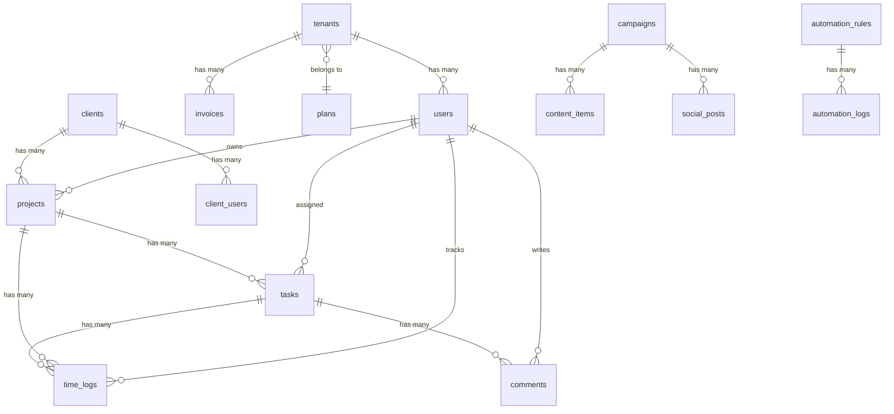

# ADA Co-OS — Veritabanı Şeması

Bu döküman tüm tabloları, ilişkileri ve özel alanları detaylandırır.

---

## 1. ER Diyagramı (Basitleştirilmiş)

---

## 2. Platform Tabloları

### `tenants`
| Sütun | Tip | Açıklama |
|:---|:---|:---|
| `id` | bigint PK | |
| `name` | string | Organizasyon adı |
| `slug` | string unique | URL-friendly isim |
| `email` | string | İletişim e-postası |
| `domain` | string nullable | Özel domain |
| `plan_id` | FK → plans | Mevcut plan |
| `status` | enum | `trial`, `active`, `suspended`, `cancelled` |
| `trial_ends_at` | datetime nullable | Deneme bitiş tarihi |
| `subscription_ends_at` | datetime nullable | Abonelik bitiş tarihi |
| `settings` | json nullable | Özel ayarlar |
| `created_at` / `updated_at` | timestamps | |

### `plans`
| Sütun | Tip | Açıklama |
|:---|:---|:---|
| `id` | bigint PK | |
| `name` | string | Plan adı (Starter, Pro, Enterprise) |
| `slug` | string unique | |
| `price_monthly` | decimal(10,2) | Aylık fiyat |
| `price_yearly` | decimal(10,2) | Yıllık fiyat |
| `max_users` | integer | Maksimum kullanıcı |
| `max_projects` | integer | Maksimum proje |
| `features` | json nullable | Özellik listesi |
| `is_popular` | boolean | Öne çıkan plan mı |
| `is_active` | boolean | Aktif mi |
| `sort_order` | integer | Sıralama |

### `invoices`
| Sütun | Tip | Açıklama |
|:---|:---|:---|
| `id` | bigint PK | |
| `tenant_id` | FK → tenants | |
| `invoice_number` | string unique | Fatura no |
| `amount` | decimal(10,2) | Tutar |
| `currency` | string(3) | Para birimi (TRY/USD/EUR) |
| `status` | enum | `draft`, `sent`, `paid`, `overdue`, `cancelled` |
| `period_start` | date | Dönem başlangıç |
| `period_end` | date | Dönem bitiş |
| `paid_at` | datetime nullable | Ödeme tarihi |
| `notes` | text nullable | Notlar |

### `platform_announcements`
| Sütun | Tip | Açıklama |
|:---|:---|:---|
| `id` | bigint PK | |
| `title` | string | Başlık |
| `content` | text | İçerik |
| `type` | enum | `info`, `warning`, `critical` |
| `is_active` | boolean | Aktif mi |
| `published_at` | datetime nullable | Yayın tarihi |

---

## 3. Core Tablolar

### `users`
| Sütun | Tip | Açıklama |
|:---|:---|:---|
| `id` | bigint PK | |
| `name` | string | Ad soyad |
| `email` | string unique | E-posta |
| `password` | string | Şifrelenmiş |
| `tenant_id` | FK nullable | null = webmaster |
| `title` | string nullable | Ünvan |
| `department_id` | FK nullable | Departman |
| `avatar` | string nullable | Profil resmi |
| `is_active` | boolean | Aktif mi |

### `clients`
| Sütun | Tip | Açıklama |
|:---|:---|:---|
| `id` | bigint PK | |
| `tenant_id` | FK nullable | |
| `name` | string | Müşteri adı |
| `contact_name` | string nullable | İlgili kişi |
| `email` | string nullable | E-posta |
| `phone` | string nullable | Telefon |
| `company` | string nullable | Şirket adı |
| `sector` | string nullable | Sektör |
| `tier` | enum | `standard`, `strategic`, `vip` |
| `status` | enum | `active`, `passive`, `lost` |
| `notes` | text nullable | Notlar |

### `client_users` *(v2.0)*
| Sütun | Tip | Açıklama |
|:---|:---|:---|
| `id` | bigint PK | |
| `client_id` | FK → clients | İlişkili müşteri |
| `name` | string | Ad soyad |
| `email` | string unique | E-posta |
| `password` | string | Şifrelenmiş |
| `is_active` | boolean | Aktif mi |
| `notifications_enabled` | boolean | Bildirim açık mı |
| `last_login_at` | datetime nullable | Son giriş |
| `remember_token` | string nullable | |

### `departments`
| Sütun | Tip | Açıklama |
|:---|:---|:---|
| `id` | bigint PK | |
| `tenant_id` | FK nullable | |
| `name` | string | Departman adı |
| `slug` | string | URL-friendly |
| `color` | string nullable | Renk kodu |
| `description` | text nullable | Açıklama |

---

## 4. Proje Yönetimi Tabloları

### `projects`
| Sütun | Tip | Açıklama |
|:---|:---|:---|
| `id` | bigint PK | |
| `tenant_id` | FK nullable | |
| `client_id` | FK nullable | İlişkili müşteri |
| `name` | string | Proje adı |
| `description` | text nullable | |
| `status` | enum | `draft`, `active`, `completed`, `archived` |
| `priority` | enum | `low`, `medium`, `high`, `critical` |
| `budget` | decimal nullable | Bütçe |
| `start_date` | date nullable | Başlangıç |
| `end_date` | date nullable | Bitiş |
| `progress` | integer 0-100 | İlerleme |
| `hourly_rate` | decimal(8,2) | Saat ücreti *(v2.0)* |
| `planned_hours` | decimal(6,1) nullable | Planlanan saat *(v2.0)* |

### `tasks`
| Sütun | Tip | Açıklama |
|:---|:---|:---|
| `id` | bigint PK | |
| `tenant_id` | FK nullable | |
| `project_id` | FK | İlişkili proje |
| `assigned_to` | FK nullable | Atanan kullanıcı |
| `title` | string | Görev başlığı |
| `description` | text nullable | |
| `status` | enum | `todo`, `in_progress`, `review`, `done` |
| `priority` | enum | `low`, `medium`, `high`, `critical` |
| `due_date` | date nullable | Son tarih |
| `start_date` | date nullable | Başlangıç *(v2.0 — Gantt)* |
| `depends_on` | FK nullable → tasks | Bağımlılık *(v2.0)* |
| `estimated_hours` | decimal(5,1) nullable | Tahmini süre *(v2.0)* |
| `is_recurring` | boolean | Tekrarlayan mı *(v2.0)* |
| `recurrence_pattern` | enum nullable | `daily`, `weekly`, `biweekly`, `monthly` *(v2.0)* |
| `recurrence_end_date` | date nullable | Tekrar bitiş *(v2.0)* |
| `parent_task_id` | FK nullable → tasks | Şablon görev *(v2.0)* |

### `time_logs` *(v2.0)*
| Sütun | Tip | Açıklama |
|:---|:---|:---|
| `id` | bigint PK | |
| `user_id` | FK → users | Çalışan kullanıcı |
| `task_id` | FK nullable → tasks | İlişkili görev |
| `project_id` | FK nullable → projects | İlişkili proje |
| `started_at` | datetime | Başlangıç zamanı |
| `stopped_at` | datetime nullable | Bitiş zamanı |
| `duration_minutes` | integer nullable | Süre (dakika) |
| `description` | text nullable | Açıklama |
| `billable` | boolean | Faturalandırılır mı |

### `comments` *(v2.0)*
| Sütun | Tip | Açıklama |
|:---|:---|:---|
| `id` | bigint PK | |
| `user_id` | FK → users | Yazan kullanıcı |
| `commentable_type` | string | Polymorphic model tipi |
| `commentable_id` | bigint | Polymorphic model ID |
| `parent_id` | FK nullable → comments | Yanıt (thread) |
| `content` | text | Yorum içeriği |
| `attachment_url` | string nullable | Dosya URL |
| `attachment_name` | string nullable | Dosya adı |
| `attachment_mime` | string nullable | MIME tipi |

---

## 5. Pazarlama Tabloları

### `campaigns`
| Sütun | Tip | Açıklama |
|:---|:---|:---|
| `id` | bigint PK | |
| `tenant_id` | FK nullable | |
| `name` | string | Kampanya adı |
| `client_id` | FK nullable | |
| `type` | string nullable | Kampanya tipi |
| `status` | enum | `planned`, `active`, `paused`, `completed` |
| `budget` | decimal nullable | |
| `start_date` / `end_date` | date nullable | Dönem |
| `kpi_target` | json nullable | Hedef KPI'lar |

### `content_items`
| Sütun | Tip | Açıklama |
|:---|:---|:---|
| `id` | bigint PK | |
| `tenant_id` | FK nullable | |
| `campaign_id` | FK nullable | İlişkili kampanya |
| `title` | string | İçerik başlığı |
| `type` | enum | `article`, `visual`, `video`, `document` |
| `status` | enum | `draft`, `review`, `approved`, `published` |
| `content` | longtext nullable | İçerik gövdesi |
| `file_path` | string nullable | Dosya yolu |

### `social_posts`
| Sütun | Tip | Açıklama |
|:---|:---|:---|
| `id` | bigint PK | |
| `tenant_id` | FK nullable | |
| `campaign_id` | FK nullable | |
| `platform` | enum | `instagram`, `twitter`, `linkedin`, `facebook`, `tiktok` |
| `content` | text | Post içeriği |
| `scheduled_at` | datetime nullable | Zamanlama |
| `published_at` | datetime nullable | Yayın tarihi |
| `status` | enum | `draft`, `scheduled`, `published` |
| `metrics` | json nullable | Etkileşim metrikleri |

---

## 6. Medya & İletişim Tabloları

### `media_insights`
Medya yansımaları (haber, basın bülteni, röportaj vb.)

### `press_contacts`
Gazeteci ve basın iletişim rehberi

### `events`
Etkinlik takibi (konferans, lansman, basın toplantısı)

### `interactions`
Müşteri etkileşimleri (telefon, toplantı, e-posta)

---

## 7. Otomasyon & Entegrasyon Tabloları *(v2.0)*

### `automation_rules`
| Sütun | Tip | Açıklama |
|:---|:---|:---|
| `id` | bigint PK | |
| `name` | string | Kural adı |
| `description` | text nullable | Açıklama |
| `trigger_model` | string | `Task`, `Project`, `Client` |
| `trigger_event` | string | `created`, `updated`, `status_changed`, `deadline_passed` |
| `condition_field` | string nullable | Koşul alanı |
| `condition_operator` | string nullable | `equals`, `not_equals`, `contains`, `greater_than` |
| `condition_value` | string nullable | Koşul değeri |
| `action_type` | string | `notify`, `change_status`, `send_email`, `assign_user`, `send_webhook` |
| `action_payload` | json nullable | Aksiyon parametreleri |
| `is_active` | boolean | Aktif mi |
| `execution_count` | integer | Çalışma sayısı |

### `automation_logs`
| Sütun | Tip | Açıklama |
|:---|:---|:---|
| `id` | bigint PK | |
| `automation_rule_id` | FK → automation_rules | |
| `model_type` | string | Tetikleyen model |
| `model_id` | bigint | Tetikleyen model ID |
| `action_type` | string | Çalıştırılan aksiyon |
| `result` | enum | `success`, `failed` |
| `log_message` | text nullable | Sonuç mesajı |

### `integration_settings`
| Sütun | Tip | Açıklama |
|:---|:---|:---|
| `id` | bigint PK | |
| `provider` | string | `slack`, `discord`, `generic_webhook` |
| `webhook_url` | string | Webhook URL |
| `is_active` | boolean | Aktif mi |
| `events` | json nullable | Tetiklenecek olaylar |

---

## 8. Dahili Araçlar Tabloları

### `incoming_emails`
IMAP üzerinden senkronize edilen e-postalar

### `email_templates`
Önceden hazırlanmış e-posta şablonları

### `brand_assets`
Logo, font, renk paleti gibi marka varlıkları

### `documents`
| Sütun | Tip | Açıklama |
|:---|:---|:---|
| `id` | bigint PK | |
| ... | ... | Mevcut alanlar |
| `version` | integer | Versiyon numarası *(v2.0)* |
| `parent_document_id` | FK nullable → documents | Önceki versiyon *(v2.0)* |
| `is_current` | boolean | Güncel versiyon mu *(v2.0)* |
| `approval_status` | enum nullable | `pending`, `approved`, `rejected` *(v2.0)* |
| `approved_by` | FK nullable → users | Onaylayan *(v2.0)* |
| `approved_at` | datetime nullable | Onay tarihi *(v2.0)* |

### `tools`
Üçüncü parti araç linkleri (Canva, Adobe, Figma vb.)

---

## 9. Sistem Tabloları

| Tablo | Paket | Açıklama |
|:---|:---|:---|
| `audits` | owen-it/laravel-auditing | Değişiklik geçmişi |
| `roles` | spatie/laravel-permission | Roller |
| `permissions` | spatie/laravel-permission | İzinler |
| `model_has_roles` | spatie/laravel-permission | Model-rol ilişkisi |
| `model_has_permissions` | spatie/laravel-permission | Model-izin ilişkisi |
| `role_has_permissions` | spatie/laravel-permission | Rol-izin ilişkisi |
| `sessions` | Laravel | Aktif oturumlar |
| `cache` | Laravel | Cache deposu |
| `jobs` / `failed_jobs` | Laravel | Kuyruk işleri |
| `notifications` | Laravel | Bildirimler |
| `telescope_*` | Laravel Telescope | Debug verileri |

---

*Son güncelleme: 14 Nisan 2026 — v2.0*
